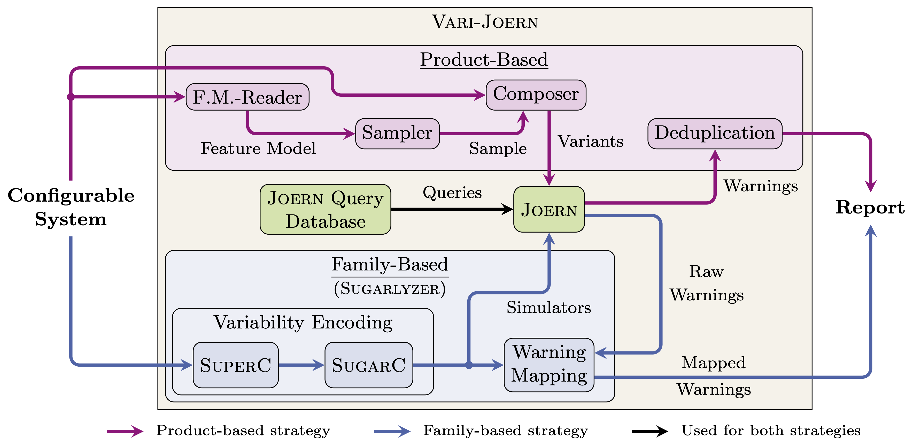

# Vari-Joern

[](https://github.com/KIT-TVA/Vari-Joern/actions/workflows/docker-image.yml)

Vari-Joern is an analysis platform for analyzing highly-configurable software systems for the presence of potential
vulnerabilities using the Q-SAST tool [Joern](https://joern.io).
It features two analysis strategies:

- **Optimized Product-Based Strategy**: Run Joern on a subset of all valid configurations of a configurable software
  system as determined through a specific sampling solution.
- **Family-Based Strategy**: Analyze a configurable software system as a whole by transforming its variable C code into
  plain C in a process commonly referred to as variability encoding. The plain C code that can then be analyzed by
  Joern.



Vari-Joern is intended to be run on an **x86-based system**. For its installation and subsequent execution, we recommend
the execution inside the corresponding Docker container, the image of which is specified in the project's
[Dockerfile](Dockerfile). The process of setting up the Docker container is described in the
[Installation](#installation) section below.

## Installation

Having installed Docker (see Docker documentation [here](https://docs.docker.com/get-started/get-docker/)
and [here](https://docs.docker.com/engine/install/) for more information), there are two ways to retrieve the Vari-Joern
container image:

1. Clone the Vari-Joern repo. The container image can then be built from scratch using the provided
   [Dockerfile](Dockerfile). This can be achieved using the following command executed from the repo's root directory:
     ```shell
     docker build -t vari-joern .
     ```
2. A pre-built image from one of Vari-Joern's earlier [releases](https://github.com/KIT-TVA/Vari-Joern/releases) can be
   imported. An overview of the available pre-built images can be
   found [here](https://github.com/KIT-TVA/Vari-Joern/pkgs/container/vari-joern). For instance, when using the release
   for VARIABILITY 2026, the image can be imported using the following command:
     ```shell
     docker pull ghcr.io/kit-tva/vari-joern:variability_2026
     ```

To run the image and enter the Docker container, you can then execute.

```shell
docker run -it -v /path/to/source:/subject -v /path/to/docker.sock:/var/run/docker.sock -v /tmp:/tmp vari-joern
```

Replace `/path/to/source` with the path to the directory at which you want to store the highly-configurable software
system(s) for the analysis and `/path/to/docker.sock` with the path to the Docker socket on the host system. It is
usually located at
`/var/run/docker.sock` or `$XDG_RUNTIME_DIR/docker.sock`. This command will start a shell in the container. From within
this shell, you can execute Vari-Joern as described in the [Execution](#execution) section below.

> **Note**: When using a pre-built image, the image name differs from `vari-joern` (e.g.,
> `ghcr.io/kit-tva/vari-joern:variability_2026` for the release for VARIABILITY 2026) and has to be adjusted in the
> command above. For example:
> ```shell
> docker run -it -v /path/to/source:/subject -v /path/to/docker.sock:/var/run/docker.sock -v /tmp:/tmp ghcr.io/kit-tva/vari-joern:variability_2026
> ```

## Execution

Before running Vari-Joern, download the source code of the software system you want to analyze (see
[Supported Subject Systems](#supported-subject-systems) further down for a list of the supported systems) and store it
in the `/path/to/source` directory (or `/subject` when downloading the subject system directly inside the running
container). For example, for version 1.36.1 of the [BusyBox](https://www.busybox.net/) project, you can run:

```shell
git clone --branch 1_36_1 https://git.busybox.net/busybox/
```

Alternatively, you can download a pre-packaged version of the source code from the corresponding website
(e.g.,https://www.busybox.net/ for BusyBox).
Next, you will need to create a configuration file that specifies how Vari-Joern should analyze the source code.
See [Configuration.md](docs/Configuration.md) for more information on how to create this file.
Finally, you can run Vari-Joern to analyze the source code. From within the Docker container (cf.
[Installation](#installation)), you can run Vari-Joern
as follows:

```shell
Vari-Joern -s [product/family] --format json --output path/to/output.json [further options] path/to/config.toml
```

This will launch a product-based (`-s product`) or family-based (`-s family`) analysis with the configuration file
`path/to/config.toml` and output the report of the analysis in JSON format to the file `path/to/output.json`.
> **Note**: See [Arguments.md](docs/Arguments.md) for a list of all available command-line options
> (cf. [further options] in the command above).

## Supported Subject Systems

Vari-Joern currently supports the following subject systems for analysis (C-LoC as reported by
[Cloc](https://github.com/AlDanial/cloc)):

|                     System                      |    Versions    | Kind                         |      C-LoC       | Supported Vari-Joern Strategy  |
|:-----------------------------------------------:|:--------------:|------------------------------|:----------------:|--------------------------------|
|     [axTLS](https://axtls.sourceforge.net/)     |     2.1.5      | SSL Client/Server Library    |      17,556      | Product-Based and Family-Based |
| [Fiasco](https://github.com/kernkonzept/fiasco) | Commit 4076045 | Microkernel                  |      46,013      | Product-Based                  |
|      [Toybox](https://landley.net/toybox/)      | 0.8.11, 0.8.12 | Linux Command Line Utilities | 61,324 (v0.8.12) | Product-Based and Family-Based |
|       [BusyBox](https://www.busybox.net/)       |     1.36.1     | Collection of UNIX Utilities |     182,966      | Product-Based and Family-Based |

> **Note**: Other versions of the subject systems might also work but have not yet been tested.

## Publications

### Investigating the Effects of T-Wise Interaction Sampling for Vulnerability Discovery in Highly-Configurable Software Systems (SPLC 2025, ⭐ [Best Artifact Award](https://2025.splc.net/awards/) ⭐)

[](https://dl.acm.org/doi/10.1145/3744915.3748462)
[](https://github.com/TDot305/Presentation-SPLC-2025/blob/cdc7bc0abb8e24cfccc1950bb36cf3316b5b7282/presentation.pdf)
[](https://zenodo.org/records/15647964)
[](https://zenodo.org/records/15849290)

> Tim Bächle, Erik Hofmayer, Christoph König, Tobias Pett, and Ina Schaefer. 2025. Investigating the Effects of T-Wise
> Interaction Sampling for Vulnerability Discovery in Highly-Configurable Software Systems. In Proceedings of the 29th
> ACM
> International Systems and Software Product Line Conference - Volume A (SPLC-A '25). Association for Computing
> Machinery,
> New York, NY, USA, 45–56. https://doi.org/10.1145/3744915.3748462


The paper investigates t-wise interaction sampling for vulnerability discovery in highly-configurable software and
introduces Vari-Joern. An evaluation on real-world systems shows that low sampling strengths, especially 2-wise, detect
most vulnerabilities, with higher strengths yielding diminishing returns.

## Licensing

Vari-Joern is licensed under a GNU General Public License version 3 (GPLv3). More details on this license can be found
in the [LICENSE](LICENSE) file.
Third-party software that was reused is licensed under its respective license, as indicated by the license files in the
corresponding subdirectory.